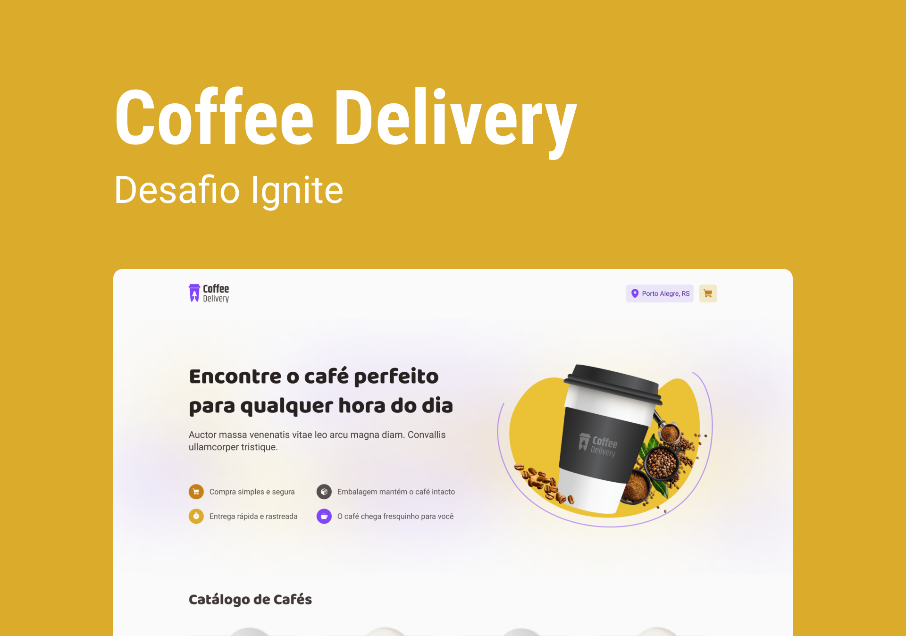

<h1 align="center">🥤 Coffee Delivery ☕</h1>

 

<h3 align="center">Um site de delivery de cafés desenvolvido com React + Typescript para a trilha de React do Ignite, Rocketseat.</h3>

---

<h2>Demonstração 🎥</h2>

_<h3>Um pequeno tour pelo Projeto 💻</h3>_

_<h3>Página Home 💻</h3>_

_<h3>Página de Checkout</h3>_

_<h3>Página de Checkout Preenchida</h3>_

_<h3>Página de Sucesso</h3>_

 

---

<h2>Fui além do desafio! 🚀</h2>

 

- ✔️ Fiz o website ser `responsivo`

 

---

<h2>Mas, o que eu aprendi? 🤔</h2>

 

- Aprendi a utilizar o `React Hook Form e Zod` para os formulários
- Aprendi a criar `variáveis auxiliares` para deixar o `código mais limpo e legível`

 

---

<h2>Tecnologias Utilizadas 🛠</h2>

#### FrontEnd: `ReactJS!`

- Axios
- React Hook Form
- Zod Resolver
- Typescript
- Context API
- Uuidv4
- React Router Dom

 
  
  
  
  
 

 

---

  
  

